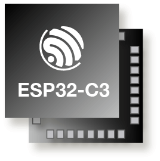
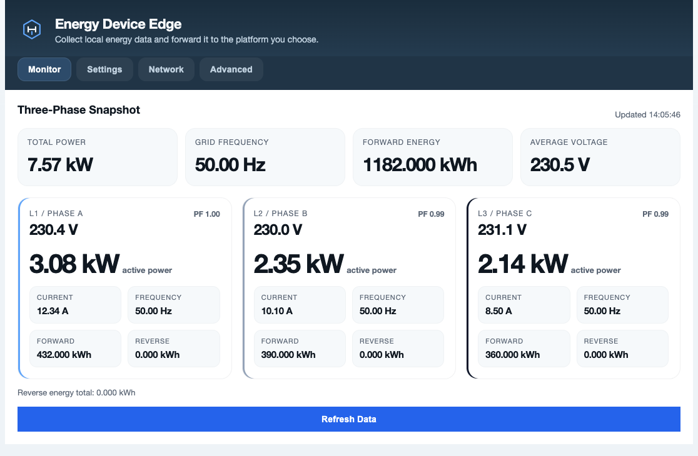
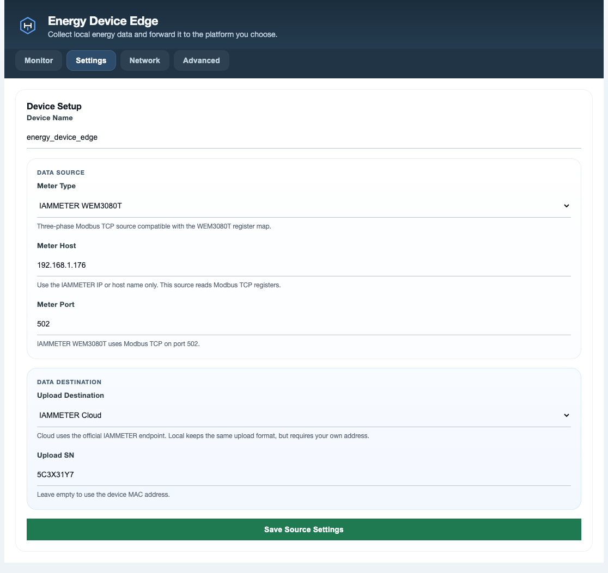

# Energy Device Edge

`energy-device-edge` is an ESP32-C3 firmware project from [EnergyMeterHub](https://www.energymeterhub.com) that turns a small Wi-Fi device into a local energy-data bridge.

It connects to a supported energy meter on your LAN, reads live three-phase data, shows it in a built-in web UI, and can forward the normalized data to cloud or local services.

## What It Does

- reads live data from a supported LAN energy meter
- shows the data in a built-in web UI
- forwards normalized data to a cloud or local service
- provides Wi-Fi setup and recovery through SoftAP mode

In short: this firmware makes an `ESP32-C3` act as a small edge gateway between a local energy meter and the platform you want to use.

## Hardware

The firmware targets `ESP32-C3`.

<p align="center">
  
</p>

Suggested use:

- ESP32-C3 development board
- 2.4 GHz Wi-Fi network
- one supported source meter on the same LAN

## UI Preview

Monitor view:



Settings view:



## Supported Sources

| Device | Type String | Protocol | Default Port |
| --- | --- | --- | --- |
| IAMMETER WEM3080T | `IAMMETER_WEM3080T` | Modbus TCP | `502` |
| Shelly Pro 3EM | `SHELLY_3EM` | Shelly RPC HTTP | `80` |

Legacy aliases are normalized automatically:

- `IAMMETER` -> `IAMMETER_WEM3080T`
- `SHELLY` -> `SHELLY_3EM`
- `SHELLY_PRO_3EM` -> `SHELLY_3EM`

## Destinations

| Destination | Type String | Notes |
| --- | --- | --- |
| Disabled | `NONE` | Read locally only |
| IAMMETER Cloud | `IAMMETER_CLOUD` | One built-in cloud target |
| IAMMETER Local | `IAMMETER_LOCAL` | User-provided compatible endpoint |

The current firmware includes built-in destination types for IAMMETER Cloud and compatible local endpoints. The project itself is meant to stay useful as a general edge bridge, not just for one service.

The uploader currently appends this path to the destination base URL:

```text
/api/v1/sensor/uploadsensor
```

Examples:

- `https://www.iammeter.com/api/v1/sensor/uploadsensor`
- `http://192.168.1.50/api/v1/sensor/uploadsensor`

## How It Works

1. Connect the device to Wi-Fi.
2. Configure a supported source meter in the web UI.
3. View live data locally in the browser.
4. Optionally forward that data to a configured destination.

## Operating Modes

### STA Mode

In normal mode the device joins your Wi-Fi, serves the web UI on the LAN, reads the configured source, and uploads data when a destination is enabled.

### SoftAP Recovery

If Wi-Fi is missing or connection fails, the device starts an open recovery hotspot:

```text
energy_device_edge_xxxx
```

where `xxxx` is derived from the MAC address.

In this mode the device keeps the network and system controls available so you can recover the connection.

## Built-In Web UI

The embedded web UI is the main control surface for the device.

Tabs and purpose:

- `Monitor`: live three-phase voltage, current, power, forward energy, reverse energy, frequency, and power factor
- `Settings`: source meter type, host, port, device name, upload destination, and upload SN
- `Network`: Wi-Fi SSID/password and nearby AP scan
- `Advanced`: firmware version, OTA update, restart, and factory reset

The UI covers live monitoring, source settings, Wi-Fi setup, OTA update, restart, and factory reset.

## API

| Method | Path | Purpose |
| --- | --- | --- |
| `GET` | `/` | Embedded web UI |
| `GET` | `/api/config` | Load saved config, UI state, and firmware metadata |
| `POST` | `/api/config` | Save the full configuration payload |
| `POST` | `/api/source` | Save and validate source, destination, and device settings |
| `POST` | `/api/network` | Save Wi-Fi settings only |
| `GET` | `/api/meter/data` | Read normalized live meter JSON |
| `GET` | `/api/wifi/scan` | Scan nearby Wi-Fi networks |
| `POST` | `/api/ota` | Upload a firmware image |
| `POST` | `/api/restart` | Restart the device |
| `POST` | `/api/factory-reset` | Clear saved config and reboot |

## Normalized Data

The device converts supported source meters into one common three-phase payload so the monitor UI and uploader do not need different logic per meter family.

## Source Notes

- `IAMMETER WEM3080T` uses port `502` by default.
- `Shelly Pro 3EM` uses port `80` by default.
- `Shelly Pro 3EM` does not report frequency in the payload used here.

## Simulator Pairing

Typical simulator ports:

- `IAMMETER WEM3080T`: `502`
- `Shelly Pro 3EM`: `18080`

Typical real-device ports:

- `IAMMETER WEM3080T`: `502`
- `Shelly Pro 3EM`: `80`

## Project Layout

- `main/` - app startup
- `components/config/` - configuration storage
- `components/wifi/` - Wi-Fi and SoftAP recovery
- `components/webserver/` - web UI delivery
- `components/settings_api/` - API endpoints
- `components/meter_client/` - supported meter integrations
- `components/cloud/` - uploader
- `docs/` - notes and README assets

## Build And Flash

Typical ESP-IDF workflow:

```bash
idf.py build
idf.py -p PORT flash monitor
```

If you use a local ESP-IDF install explicitly:

```bash
export IDF_PATH=/path/to/esp-idf
. $IDF_PATH/export.sh
idf.py build
idf.py -p PORT flash monitor
```

## Provisioning Walkthrough

1. Flash the firmware to an `ESP32-C3` board.
2. On first boot, connect to the recovery hotspot if normal Wi-Fi is not available.
3. Open the device IP in a browser.
4. In `Network`, save the Wi-Fi SSID and password.
5. In `Settings`, choose the source type, enter the source host and port, then choose the destination.
6. Save the source settings and wait for the device to restart.
7. Open `Monitor` to confirm that live data is updating.

## Notes

- This is an open-source firmware project from [EnergyMeterHub](https://www.energymeterhub.com).
- `sdkconfig.defaults` is the checked-in baseline config.
